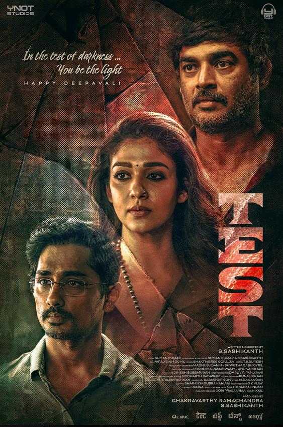
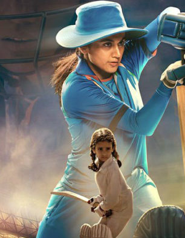
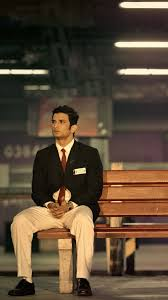

# NetFlix_Clone
## Date:09-07-2025
## Objective:
To create a modern, responsive navigation bar using CSS Flexbox, mimicking real-world websites like Netflix. This helps reinforce alignment, spacing, and layout structuring using Flexbox properties.

## Tasks:

#### 1. Structure the HTML Layout:
Use a ```<nav>``` tag as the main container.

Add a brand logo/title on the left using a ```<div> or <h1>```.

Add navigation links like Home, Menu, About, Contact, and Login using a ```<ul> with <li> and <a>```.

#### 2. Apply Flexbox for Layout:
Use display: flex on the ```<nav>``` container.

Use justify-content: space-between to align the logo and menu.

Use align-items: center to vertically center both sections.

Style list items with horizontal spacing using gap or margin.

#### 3. Style Like a Real-World Navbar:
Add background color (e.g., dark or gradient like Netflix/Zomato).

Style text with bold fonts, hover effects, and link styling.

Remove default ul and li styles (list-style: none, text-decoration: none).

#### 4. Bonus Enhancements:
Add a hover underline or button effect on links.

Make it responsive using flex-wrap or media queries.

Fix the nav bar to top with position: sticky.
## HTML Code:
```
<!DOCTYPE html>
<html lang="en">
<head>
  <meta charset="UTF-8" />
  <title>StreamBox - Home</title>
  <link rel="stylesheet" href="style.css" />
</head>
<body>

  <header class="topbar">
    <div class="logo-section">
      
      <span class="tagline">| Explore Originals</span>
    </div>

    <nav>
      <ul class="nav-menu">
        <li><a href="#">Home</a></li>
        <li><a href="#">Movies</a></li>
        <li><a href="#">TV Shows</a></li>
        <li><a href="#">My List</a></li>
      </ul>
    </nav>

    <div class="user-section">
      <input type="search" placeholder="Search titles..." class="search-input" />
      
    </div>
  </header>
  <section class="featured" style="background-image: url('mn.jpeg');">
    <div class="featured-overlay">
      <div class="featured-content">
        <h4>SPORTS | BIOPIC | INSPIRATIONAL</h4>
        <h1>800</h1>
        <p>2023 | DIRECTOR: M.S. Sripathy | LANGUAGES: Tamil, Hindi, English</p>
        <p class="desc">
          A heartfelt biopic based on the life of legendary Sri Lankan spinner Muttiah Muralitharan — the man who turned cricketing odds into history by becoming the highest wicket-taker in the world.
        </p>
        <div class="featured-buttons">
          <button class="stream">WATCH NOW</button>
          <button class="episodes">TRAILER</button>
        </div>
      </div>
      <div class="trailer-icon">
        <button>▶ Watch Trailer</button>
      </div>
    </div>
  </section>
<section class="popular">
    <h2>Popular Shows This Week</h2>
    <div class="slider">
      <div class="movie-card"><p>Test</p></div>
      <div class="movie-card"><p>83</p></div>
      <div class="movie-card"><p>Mithu</p></div>
      <div class="movie-card"><p>M S Dhont (The Untold Story)</p></div>
    </div>
  </section>

</body>
</html>


```
## CSS Code:
```
* {
  margin: 0;
  padding: 0;
  box-sizing: border-box;
}

body {
  background-color: #000;
  color: white;
  font-family: 'Segoe UI', Tahoma, Geneva, Verdana, sans-serif;
}
.topbar {
  display: flex;
  justify-content: space-between;
  align-items: center;
  padding: 18px 40px;
  background-color: rgba(0, 0, 0, 0.8);
  position: sticky;
  top: 0;
  z-index: 10;
}

.logo-section {
  display: flex;
  align-items: center;
  gap: 10px;
}

.logo {
  width: 50px;
}

.tagline {
  font-size: 14px;
  color: #ccc;
}

.nav-menu {
  display: flex;
  list-style: none;
  gap: 30px;
}

.nav-menu a {
  text-decoration: none;
  color: #fff;
  font-weight: bold;
  transition: 0.3s ease;
}

.nav-menu a:hover {
  color: #e50914;
}

.user-section {
  display: flex;
  align-items: center;
  gap: 15px;
}

.search-input {
  padding: 6px 14px;
  border: none;
  border-radius: 20px;
  background-color: #1a1a1a;
  color: white;
}

.avatar {
  width: 36px;
  height: 36px;
  border-radius: 50%;
  object-fit: cover;
  border: 2px solid #e50914;
}

/* Featured Section */
.featured {
  background-size: cover;
  background-position: center;
  position: relative;
  padding: 80px 40px;
  color: white;
}

.featured-overlay {
  background: rgba(0, 0, 0, 0.6);
  display: flex;
  justify-content: space-between;
  align-items: flex-start;
  padding: 40px;
  gap: 20px;
  flex-wrap: wrap;
}

.featured-content {
  max-width: 60%;
}

.featured-content h4 {
  font-size: 14px;
  color: #ccc;
  margin-bottom: 10px;
}

.featured-content h1 {
  font-size: 64px;
  letter-spacing: 2px;
  margin-bottom: 10px;
}

.featured-content p {
  font-size: 14px;
  margin-bottom: 10px;
}

.desc {
  color: #ccc;
  max-width: 500px;
  margin-bottom: 20px;
}

.featured-buttons button {
  padding: 10px 18px;
  margin-right: 10px;
  border-radius: 4px;
  border: none;
  font-weight: bold;
  cursor: pointer;
}

.stream {
  background-color: #e50914;
  color: white;
}

.episodes {
  background-color: transparent;
  border: 1px solid #ccc;
  color: white;
}

.trailer-icon button {
  background: none;
  border: none;
  color: white;
  font-size: 16px;
  cursor: pointer;
}
.popular {
  padding: 40px;
}

.popular h2 {
  font-size: 24px;
  margin-bottom: 20px;
}

.slider {
  display: flex;
  gap: 20px;
  overflow-x: auto;
  padding-bottom: 10px;
}

.movie-card {
  min-width: 180px;
  background-color: #111;
  border-radius: 6px;
  overflow: hidden;
  text-align: center;
  transition: transform 0.3s;
}

.movie-card img {
  width: 100%;
  height: 240px;
  object-fit: cover;
  border-bottom: 3px solid #e50914;
}

.movie-card p {
  padding: 10px;
}

.movie-card:hover {
  transform: scale(1.05);
}


```
## Output:


## Result:
A modern, responsive navigation bar using CSS Flexbox, mimicking real-world websites like Netflix. This helps reinforce alignment, spacing, and layout structuring using Flexbox properties is created successfully.
